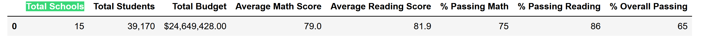
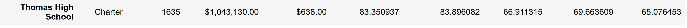
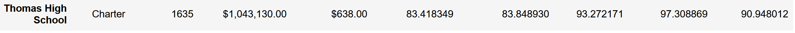
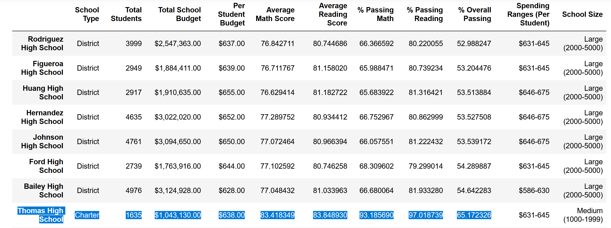

# School Data Analysis Project

## Overview of Project
During this project the data from high schools will be analyzed and organized. The main deliverables that required for this project:

  Top 5 and bottom 5 performing schools, based on the overall passing rate
  The average math score received by students in each grade level at each school
  The average reading score received by students in each grade level at each school
  School performance based on the budget per student
  School performance based on the school size
  School performance based on the type of school
At the end of the Analysis we received the information that the scores from Thomas High School ninth graders appear to have been altered and should be removed from the report.

### Purpose
To identify the successful and unsuccessful schools in order to create future targets and goals. To remove ninth graders' scores from Thomas High School results.

### Performing programming.
For solving this task we will use Python programming with an additional Jupyter notebook tool and additional libraries such as Panda and Numpy.

### Challenges and Difficulties Encountered
Using Jupiter and additional libraries requires additional education which takes some time.

## Results
Removing Thomas High School ninth graders crores affected the district summary:  the overall passing is dropped by 0.1%

The affection of school summary is more dramatic for Thomas High School     and drops overall passing from 90.4 to 65.1

Removing 9th graders' scores moved Thomas High School from top 2 school to 3th place from bottom.

Removing the Thomas High School affected the overall math score by 0,1 point

The overall passing % in  Thomas High School budget $638 equal 90.6

The overall passing percent in medium school size is 91%

School type cChapter have 90% passing.

## Summary
The removal of Thomas High School ninth graders' scores affected the overall passing and math score.
